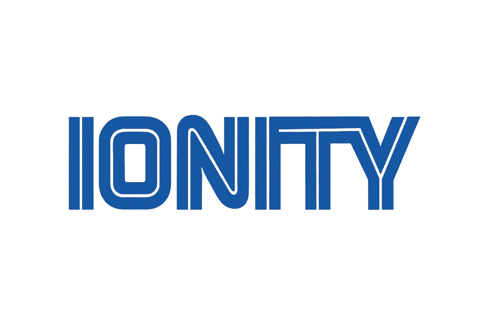

<div align="center">



# Ionity Assets · `ionity-assets-ionity-global-ionity-today`

**Official brand & web assets for Ionity Global (Pty) Ltd and Ionity (Pty) Ltd**

[](License-Ionity%20Global.txt)
[](https://www.ionity.world/)
[](https://www.ionity.today/)
[](mailto:ai@ionity.today)
[](https://orcid.org/0009-0005-7181-0347)

</div>

---

## 📋 Overview

This repository is the **single source of truth** for all brand assets, UI components, media files, legal documents, and web integration resources used across Ionity's digital properties — including [ionity.world](https://www.ionity.world/) and [ionity.today](https://www.ionity.today/).

> **Author:** Johan Wilhelm van Antwerp  
> **Organisation:** Ionity Global (Pty) Ltd — Centurion, South Africa  
> **Contact:** [ai@ionity.today](mailto:ai@ionity.today) · +27 646 999 877  
> **Policy:** Active as of 2026-04-12 · Version 7.3.1 · Policy 986 AED

---

## 📁 Repository Structure

```
ionity-assets/
├── images/                  # Logos, icons, social cards, author photos
│   ├── ionity-logo-edited.png/.svg
│   ├── ionity-social-card.png/.svg
│   ├── AEDI-LOGo.*          # Antwerp Edge Design Intelligence logo
│   ├── author-johan.jpg/.svg
│   └── ...
├── css/
│   └── style.css            # Global Ionity stylesheet (cookie banner, sliders, mobile)
├── js/                      # JavaScript utilities
├── favicon/                 # Favicons for all platforms
├── videos/                  # Brand intro & ecosystem showcase videos
│   ├── Ionity_intro_implosion_nodes_networks_*.mp4
│   └── Clip_Ecosystem_1.mp4
├── cookies/                 # Cookie consent implementation
├── seo/
│   └── schema-organization.jsonld  # Structured data / Schema.org
├── Lisences,Policy,EULA/    # Legal documents (PDF)
├── assets/                  # Compressed asset bundles
│   └── assets.7z
├── Ai-ionity.png            # AI Ionity brand graphic
├── Ionity_Global_Pty_LTD_Transparrent*.png
├── ionity_animation_transp.gif
├── IONITY_INTRO_POWERSHELL.ps1  # Branded PowerShell intro script
├── Johan_Wilhelm_van_Antwerp.vcf  # Contact card (vCard)
└── License-Ionity Global.txt
```

---

## 🖼️ Key Assets

| Asset | Description | Format |
|---|---|---|
| `images/ionity-logo-edited.*` | Primary Ionity logo (transparent) | PNG · SVG |
| `images/ionity-social-card.*` | Open Graph / social media card | PNG · SVG |
| `images/AEDI-LOGo.*` | Antwerp Edge Design Intelligence logo | ICO · JPEG · SVG |
| `Ionity_Global_Pty_LTD_Transparrent*.png` | Full company logo (transparent, optimised) | PNG |
| `ionity_animation_transp.gif` | Animated brand GIF | GIF |
| `images/author-johan.jpg` | Author / founder portrait | JPG |
| `favicon/` | Favicons (all sizes & formats) | ICO · PNG · SVG |
| `videos/` | Brand intro & ecosystem showcase | MP4 |
| `css/style.css` | Shared stylesheet | CSS |
| `seo/schema-organization.jsonld` | Schema.org structured data | JSON-LD |

---

## ⚙️ Usage

### Link CSS in your HTML

```html
<!-- From CDN / raw GitHub (replace TAG with the latest release tag) -->
<link rel="stylesheet" href="https://raw.githubusercontent.com/Ionity-Global/ionity-assets-ionity-global-ionity-today/main-Ionity/css/style.css">
```

### Embed the Schema.org snippet

```html
<script type="application/ld+json">
  <!-- contents of seo/schema-organization.jsonld -->
</script>
```

### Use a logo

```html

```

---

## 🪪 Licensing

This repository uses **multiple licence models** across different asset types:

| Section | Licence | Covers |
|---|---|---|
| §1 | [Apache License 2.0](http://www.apache.org/licenses/LICENSE-2.0) | Web design, illustration, images (non-NFC), and artwork |
| §2 | [MIT License](https://opensource.org/licenses/MIT) | Software, scripts, and code components |
| §3+ | Proprietary / Restricted | NFC assets, EULA-governed media |

Full licence text: [`License-Ionity Global.txt`](License-Ionity%20Global.txt)  
EULA & policy PDFs: [`Lisences,Policy,EULA/`](Lisences%2CPolicy%2CEULA/)  
Live licence page: [ionity.today/license.html](https://www.ionity.today/license.html)

---

## 🔗 Links

| | |
|---|---|
| 🌍 Website | [ionity.world](https://www.ionity.world/) |
| 📰 Today | [ionity.today](https://www.ionity.today/) |
| 💼 LinkedIn | [linkedin.com/in/johanwilhelmvanantwerp](https://www.linkedin.com/in/johanwilhelmvanantwerp) |
| 📧 Email | [ai@ionity.today](mailto:ai@ionity.today) |
| 📞 Phone | +27 646 999 877 |
| 🔬 ORCID | [0009-0005-7181-0347](https://orcid.org/0009-0005-7181-0347) |
| 📖 Wiki | [Repository Wiki](https://github.com/Ionity-Global/ionity-assets-ionity-global-ionity-today/wiki) |

---

<div align="center">

© 2026 **Ionity Global (Pty) Ltd** · Centurion, South Africa  
*Building the future of IoT, AI & Edge Intelligence*

</div>
