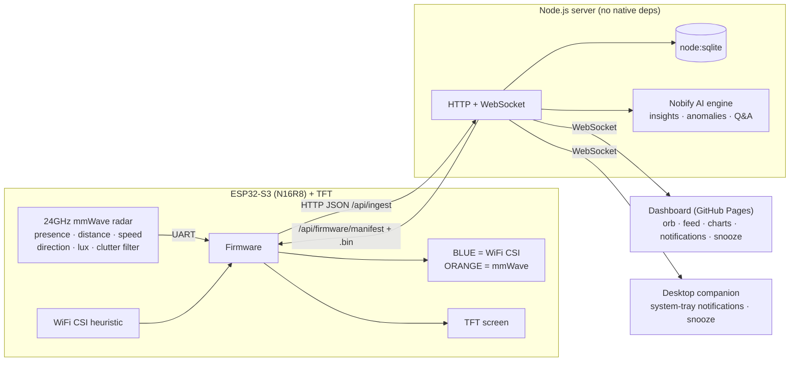

# Nobify — Dual-Sensor Human Presence Detection

Nobify is a full-stack human-presence system built around an **ESP32-S3** and a
**24 GHz mmWave radar**. It detects **humans only**, measures **distance,
movement (speed + approaching/leaving)** and **ambient light**, filters out
clutter (airflow, pets, swaying plants), and streams everything over WiFi to a
hosted server with a real-time dashboard, desktop notifications, snooze, and a
built-in **AI assistant**.



## Highlights

- **Human-only 24 GHz mmWave** presence with **range gating** and **clutter
  suppression** (background calibration + micro-motion threshold + debounce) so
  airflow, pets and plants don't trigger it.
- **Movement**: target **speed** and **direction** (approaching / leaving /
  stationary), derived from the distance signal.
- **Environmental**: built-in **ambient light 0–50 lux** → day/night ("is it
  dark") indicator on the device, dashboard and AI.
- **Two detection sources, two LEDs**: **BLUE** when WiFi CSI sees a person,
  **ORANGE** when the mmWave radar sees a person. The dashboard mirrors both.
- **Real-time dashboard** (WebSocket): presence orb, live feed with timestamps &
  distance, hourly activity chart, device status, **desktop notifications**,
  **snooze**, and sound.
- **Built-in AI** (offline, deterministic): activity summaries, **anomaly
  detection**, sensor-fusion confidence, occupancy/dwell metrics, and a
  natural-language **chat assistant**.
- **Desktop companion**: a system-tray app that pops **notifications** on
  detection with distance/direction/day-night, and **snoozes** in sync with the
  server. Runs with **zero dependencies** (built-in polling + native balloons).
- **Over-the-air (OTA) updates**: devices self-update from the server
  (`/api/firmware/manifest`, MD5-verified) plus local ArduinoOTA push.
- **YAML-driven config**: one `nobify.config.yaml` is the source of truth; a
  generator turns it into the firmware header so the device needs no YAML parser.
- **CI/CD**: GitHub Actions test the server, syntax-check the apps, **compile the
  firmware** with PlatformIO, publish the dashboard to Pages, sync the **Wiki**,
  and cut **Releases** with companion binaries + firmware `.bin`.

## Repository layout

```
nobify/
├── firmware/                 ESP32-S3 PlatformIO project
│   ├── nobify.config.yaml     ← edit device/sensor/OTA settings here
│   ├── include/nobify_config.h  (generated — do not edit)
│   └── src/  main · mmwave · wifi_csi · leds · display · net · ota
├── server/                   Node.js backend (http + ws + node:sqlite + AI + OTA)
│   ├── src/  server · db · ai · config · firmware
│   ├── scripts/ gen-firmware-config
│   ├── firmware/  OTA binaries + manifest.json (git-ignored)
│   └── test/ smoke.test.js
├── companion/                Desktop system-tray notifier (zero-dep capable)
│   └── src/  index · config · notify · tray
├── webapp/                   Static dashboard + Install page (GitHub Pages friendly)
└── wiki/                     Documentation synced to the GitHub Wiki
```

## Quick start

### 1) Server (needs Node.js ≥ 22.5 for built-in `node:sqlite`)

```bash
cd nobify/server
npm install
cp config.example.yaml config.yaml     # optional; defaults are fine
npm start                               # → http://localhost:8787
```

Open **http://localhost:8787/** for the dashboard. Run `npm test` for the
end-to-end smoke test.

### 2) Configure & flash the ESP32-S3

Edit `firmware/nobify.config.yaml` (WiFi, server URL, pins), then:

```bash
cd nobify/server && npm run gen:firmware   # YAML → firmware/include/nobify_config.h
cd ../firmware && pio run -t upload && pio device monitor
```

### 3) Desktop companion (system-tray notifications)

```bash
cd nobify/companion
npm install                                 # optional — tray icon + rich toasts
npm start -- --server http://localhost:8787
```

Runs with zero deps too (polling + native balloons). Prebuilt binaries are
attached to each GitHub Release; the dashboard's **⤓ Install** page links them.

### 4) Publish the dashboard (GitHub Pages)

The workflow `.github/workflows/nobify-pages.yml` deploys `nobify/webapp`.
Enable **Settings → Pages → Source: GitHub Actions**. Since Pages is static,
point it at your hosted backend via the in-app **⚙ Settings** (stored in the
browser) or by editing `webapp/config.js`.

### 5) Over-the-air updates

Publish a build to `server/firmware/` (the **Nobify Release** workflow does this
on a `nobify-v*` tag) and devices self-update from `/api/firmware/manifest`.
See the Wiki's **Firmware and OTA** page.

## HTTP / WebSocket API

| Method | Path | Purpose |
| --- | --- | --- |
| `POST` | `/api/ingest` | Device uploads presence events (optional `x-ingest-key`) |
| `GET` | `/api/state` | Live presence + snooze |
| `GET` | `/api/alerts?limit=&since=&device=` | Detection history |
| `GET` | `/api/stats` | Aggregates (by hour, by source, avg distance) |
| `GET` | `/api/devices` | Registered devices + online state |
| `GET` | `/api/ai/insights` | AI summary, anomalies, fusion, recommendations |
| `POST`/`GET` | `/api/ai/ask` | Natural-language question → answer |
| `GET`/`POST` | `/api/snooze` | Read / set / clear alert snooze |
| `GET` | `/api/health` | Health check |
| `GET` | `/api/firmware/manifest?current=<ver>` | OTA: latest build + `updateAvailable` |
| `GET` | `/firmware/<name>.bin` | OTA: firmware image (MD5-verified) |
| `WS` | `/ws` | Real-time `alert` / `state` / `snooze` events |

**Ingest payload** (single or batched `events`):

```json
{
  "device_id": "esp32-s3-01",
  "rssi": -52,
  "events": [
    { "source": "mmwave", "present": true, "distance_cm": 138,
      "speed_cms": -7, "direction": "approaching", "lux": 3, "confidence": 0.94 },
    { "source": "wifi", "present": true }
  ]
}
```

## Sensor / hardware notes

- The radar driver targets the common **LD2410-style 24 GHz UART protocol**
  (presence + distance + energy). Speed/direction are derived from the distance
  signal; ambient light is read from the module or an LDR on `ambient_light.adc_gpio`.
  If you use a different 24 GHz module, adapt `firmware/src/mmwave.cpp::decode()`.
- **WiFi CSI** presence uses the ESP32-S3's Channel State Information: human
  motion raises the CSI amplitude variance above a threshold.
- LEDs default to a 2-pixel NeoPixel chain on the WiFi LED GPIO (BLUE, ORANGE);
  set `leds.neopixel: false` for two plain GPIO LEDs.

See `firmware/README.md`, `server/README.md` and `companion/README.md` for
details, and the **[Wiki](../../wiki)** for the full guide (architecture,
wiring, configuration, OTA, CI/CD, troubleshooting).

## License

MIT — © Ionity Global / Nobify.
