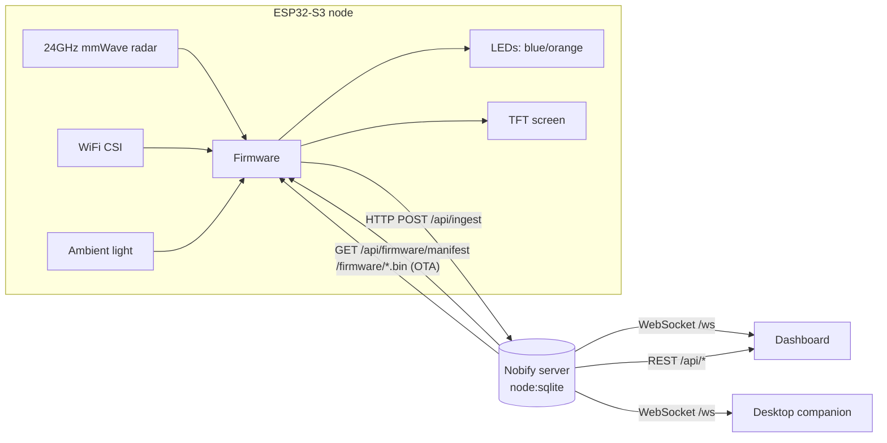

# Architecture

## Data flow

1. The **firmware** fuses two independent sensors:
   - **mmWave (ORANGE)** — human-only 24 GHz radar; distance, energy, movement.
   - **WiFi CSI (BLUE)** — motion from WiFi channel-state variance.
   It also reads **ambient light** (0–50 lux) and applies **clutter suppression**.
2. It uploads events to **`POST /api/ingest`** over WiFi (one event per source, so
   the server can drive both LEDs and compute fusion).
3. The **server** stores everything in SQLite (`node:sqlite`, no native deps),
   derives live state, and broadcasts over **WebSocket** to every client.
4. The **dashboard** and **companion** subscribe and react in real time
   (LED mirroring, notifications, snooze, AI insights).
5. For updates, devices poll **`/api/firmware/manifest`** and pull a new
   **`.bin`** over the air.

## Why these choices

- **`node:sqlite`** → no build tools, no `node-gyp`, runs anywhere Node ≥ 22.5 does.
- **YAML as the single source of truth** → the firmware header is *generated*
  from `nobify.config.yaml`, so the device carries no YAML parser.
- **Static dashboard** → hostable on GitHub Pages; it talks to your backend via a
  configurable URL.
- **Zero-dep companion core** → the tray app works even before `npm install`.
